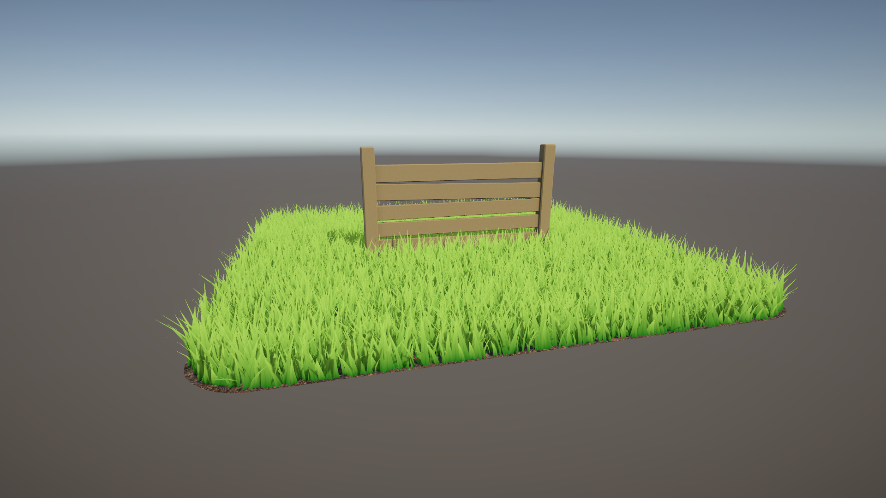
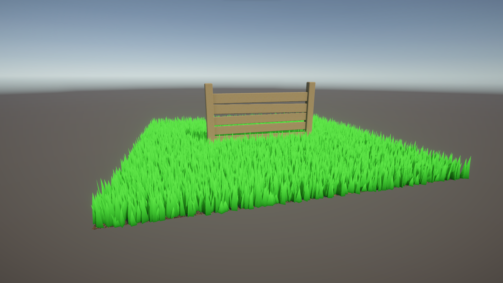
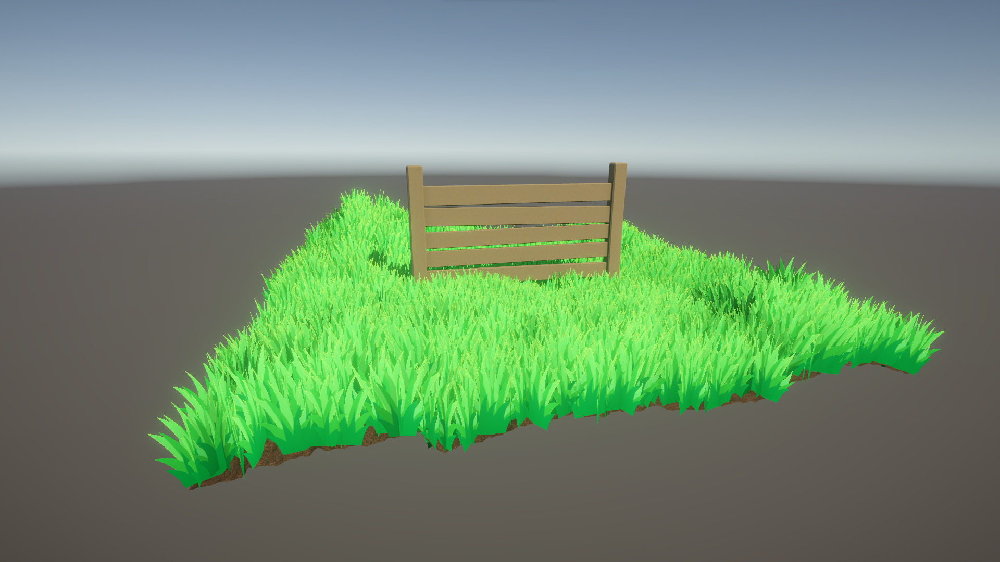

# UnityGrassShader
A project in Unity based on Daniel Ilett's grass rendering techniques. This project is made for exploring modern grass and foliage rendering techniques using Unity3D Game Engine.

This is an aside project which I decided to do in order to extend one of my Computer Graphics Masters Degree's assigments.
On this assignment I have to implement a custom grass shader with Unity shaders, using geometry and tessellation shaders.
Instead I will implement that shader and try to implement an alternative version using compute shaders.

## Roadmap
Main features to implement:
- [x] Implement Geometry and Tessellation Shaders
- [x] Implement Procedural Rendering and Compute Shaders
- [ ] Season based grass coloring (Selectable from UI)
- [x] Exploring Unity Terrains for grass rendering

Optional features:
- [ ] Season synchronizing with date
- [ ] White noise on gameplay

## Implemented techniques
- [x] Grass Tiles
- [x] Geometry/Tessellation Grass
- [x] Procedural Compute Grass
- [x] Unity Terrains Grass
- [ ] Billboarding

## Interesting links
[Six Grass Rendering Techniques in Unity by Daniel Ilett](https://danielilett.com/2022-12-05-tut6-2-six-grass-techniques/)  
[Roystan Grass Shader (the skeleton of the assignment)](https://roystan.net/articles/grass-shader/)  
[An astounishing grass shader made by Staggart Creations](https://forum.unity.com/threads/stylized-grass-shader-urp.804000/)  
[Grass Rendering in OpenGL // Code Review - An interesting review made by TheCherno](https://www.youtube.com/watch?v=2h5NX9tIdno)  

### Other useful links
[Unity Shaders Bible (a must when doing shaders in Unity)](https://www.jettelly.com/books/unity-shaders-bible/)  
[A necessary post when dealing with URP custom shaders by Steven Cannavan](https://blog.unity.com/engine-platform/shedding-light-on-universal-render-pipeline-for-unity-2021-lts)
